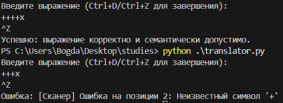

# Транслятор выражений с присваиванием и инкрементом

**Автор**: Паршучихин Богдан  
**Группа**: КМБО-02-23  
**Вариант**: 12 

## Описание

Программа анализирует выражения, состоящие из:
- переменных (`VAR`),
- целочисленных литералов (`INT`),
- оператора присваивания (`=`),
- префиксного и постфиксного инкремента (`++`).

Поддерживаются цепочки присваивания и каскадные инкременты, например:
- `a = b = ++c`
- `++a = b++`
- `a = ++++x`

Программа проверяет:
- корректность синтаксиса,
- семантическую допустимость (нельзя писать `123 = x`).

## Грамматика

```bnf
<Start>                  ::= <ВыражениеПрисваивания>
<ВыражениеПрисваивания>  ::= <ПростоеВыражение> <ОстальныеПрисваивания>
<ОстальныеПрисваивания>  ::= '=' <ВыражениеПрисваивания> | ε
<ПростоеВыражение>       ::= <МножественныйИнкремент> <Операнд> <МножественныйИнкремент>
<МножественныйИнкремент> ::= '++' <МножественныйИнкремент> | ε
<Операнд>                ::= VAR | INT
```
## Пример работы:



## Установка
Требуется Python 3.7+.

Создайте рабочую папку 
```
mkdir translator-project
cd translator-project
```
Склонируйте репозиторий
```
git clone https://github.com/BiGiPiG/translators.git
```

## Использование
Из терминала:

Ввод с клавиатуры (Ctrl+D/Ctrl+Z завершает ввод)
```
python translator.py
```

Или из файла
```
python translator.py input.txt
```